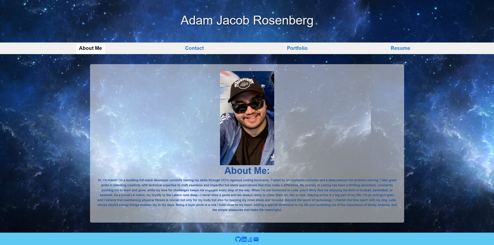

# AdamsReact_Portfolio

Welcome to my digital portfolio! This single-page application is crafted to showcase my journey and achievements as an aspiring web developer. Utilizing modern technologies, this site offers a glimpse into my professional background while demonstrating my technical expertise.

- At the top of the page, you'll see my name alongside a sleek, responsive navigation menu that adjusts seamlessly to any screen size. This menu guides you through the various sections: About Me, Portfolio, Contact, and Resume. It also highlights the section you're currently viewing for easy navigation.

- As you navigate through the menu, each section smoothly appears below, with the URL updating accordingly to reflect the current section.

- Browse through a gallery of my projects, where each is showcased with an image and provides links to the live application and its source code on GitHub.

- Looking to get in touch? I’ve created a user-friendly contact form that makes reaching out a breeze!

- Head over to my resume section to find an overview of my technical skills and expertise.

- In the footer, you'll find convenient links to my GitHub, LinkedIn, Stack Overflow, and email. It’s like a digital business card—choose your preferred way to connect!

## Installation

To install AdamsReact_Portfolio:

- Clone the repository: `https://github.com/AcoderRose/AdamsReact_Portfolio`

- Go to the project directory

- Launch the terminal and install the dependencies by executing the following command: `npm install`

## Usage

- Start the application, in the terminal by executing the following command: `npm run start`

- You will be redirected to the application: `http://localhost:3000/`
 

[Link to Deployed AdamsReact_Portfolio Application](https://adamsreact-portfolio.netlify.app)

## Credits

[Kaila Ronquillo](https://github.com/girlnotfound)

[Ryan Petersen](https://github.com/RyanPetersen-89)
